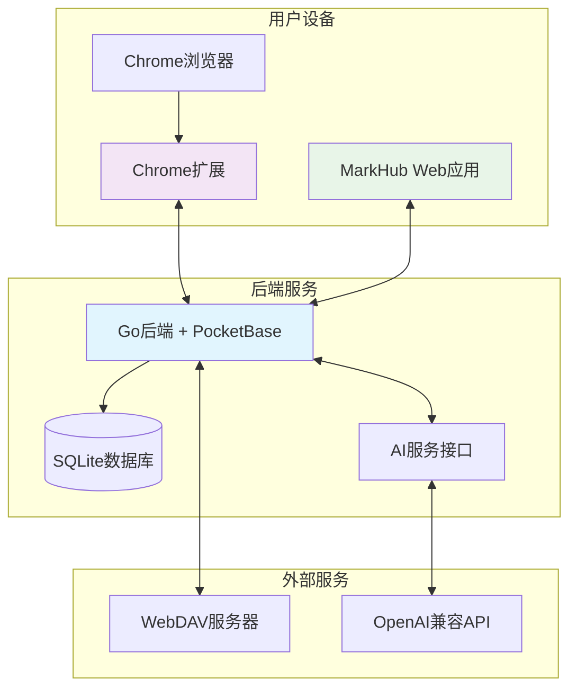
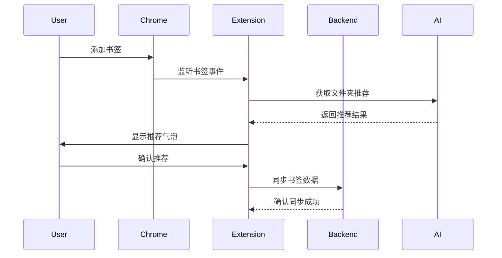

# MarkHub - 智能书签管理平台

MarkHub 是一个现代化的全栈书签管理平台，提供强大的AI辅助功能和完整的多设备同步体验。通过精心设计的架构，为用户提供高效、智能的书签管理解决方案。

[English Version](README_EN.md)

## 快速开始

### 本地部署

#### 使用 Docker Compose（推荐）

```bash
# 克隆项目
git clone https://github.com/yourusername/markhub.git
cd markhub

# 启动服务
docker-compose up -d

# 访问应用
# 前端: http://localhost:3000
# 后端: http://localhost:8090
# 后端管理页面: http://localhost:8090/_/
```

#### 手动部署

```bash
# 后端服务
cd backend
go run main.go serve

# 前端服务
cd frontend
npm install
npm run dev
```

### Chrome 扩展协作

我们提供功能完整的Chrome浏览器扩展，支持智能书签管理和双向同步，此扩展支持独立使用：

- **智能添加**: AI文件夹推荐，一键添加书签（此功能无需登录即可直接使用）
- **双向同步**: Chrome ↔ MarkHub 完整数据同步
- **实时更新**: 书签变更自动同步到云端
- **离线工作**: 支持离线添加，联网后自动同步

## 技术架构

### 前端技术栈

- **核心框架**: Next.js 15.2.4 (React 19)
- **语言**: TypeScript
- **样式**: Tailwind CSS + Radix UI
- **状态管理**: React Context API
- **性能优化**: 虚拟列表渲染、代码分割
- **搜索功能**: Fuse.js 模糊搜索
- **国际化**: 多语言支持（中文/英文）

### 后端技术栈

- **核心框架**: Go + PocketBase
- **数据库**: SQLite（内嵌）
- **认证系统**: PocketBase 内置用户系统
- **API设计**: RESTful API + 自定义路由
- **AI集成**: OpenAI兼容接口支持
- **文件存储**: WebDAV 同步支持

### Chrome 扩展技术栈

- **框架**: React 18 + TypeScript
- **UI组件**: Mantine 7 + Tailwind CSS
- **构建工具**: Vite
- **扩展标准**: Manifest V3
- **模块化设计**: 核心功能独立模块

## 核心功能

### 🔖 智能书签管理

- **完整CRUD操作**: 添加、编辑、删除、批量操作书签
- **层级文件夹系统**: 支持无限层级的文件夹嵌套
- **智能标签系统**: 多标签分类，支持标签管理和过滤
- **收藏功能**: 快速标记和访问重要书签及文件夹
- **高级搜索**: 基于Fuse.js的模糊搜索，支持标题、URL、标签多字段搜索

### 🤖 AI 智能辅助

- **AI标签生成**: 基于网页内容自动生成相关标签，只从现有标签中推荐
- **AI文件夹推荐**: 智能分析书签内容，推荐最合适的文件夹分类
- **内容提取**: 自动抓取网页元数据、标题、描述等信息
- **多AI服务支持**: 兼容OpenAI格式的各种AI服务
- **智能匹配**: 确保推荐结果与现有分类体系保持一致

### 🔄 多设备同步

- **用户认证系统**: 基于PocketBase的完整用户管理
- **云端数据存储**: 所有数据安全存储在后端数据库
- **WebDAV同步**: 支持与WebDAV服务器的双向数据同步
- **Chrome扩展同步**: Chrome书签与MarkHub的完整双向同步
- **实时更新**: 数据变更实时同步到所有设备

### 🎨 用户体验

- **响应式设计**: 完美适配桌面端和移动端
- **多语言支持**: 中文/英文界面切换
- **主题定制**: 深色/浅色模式，自定义主题色

### 📊 数据管理

- **导入导出**: 支持JSON、HTML格式的数据备份和恢复
- **数据迁移**: 从其他书签管理工具无缝迁移
- **批量操作**: 支持批量编辑、删除、移动书签
- **数据统计**: 提供书签数量、分类统计等信息
- **安全备份**: 多种备份方式确保数据安全

## 系统架构

### 整体架构设计

MarkHub 采用现代化的全栈架构，由前端应用、Go后端服务和Chrome扩展三部分组成：



### 前端架构

#### 状态管理

- **React Context API**: 集中管理应用状态
- **BookmarkContext**: 书签数据、文件夹结构、标签管理
- **AuthContext**: 用户认证状态、Token管理
- **LanguageContext**: 多语言支持和切换

#### 组件架构

```
frontend/
├── app/                    # Next.js App Router
│   ├── layout.tsx         # 全局布局
│   ├── page.tsx           # 主页面
│   ├── login/             # 登录页面
│   └── register/          # 注册页面
├── components/            # 功能组件
│   ├── bookmark-dashboard.tsx    # 主控制面板
│   ├── bookmark-list.tsx         # 书签列表
│   ├── folder-tree.tsx           # 文件夹树
│   ├── tag-panel.tsx             # 标签面板
│   └── ui/                       # UI基础组件
├── context/               # React Context
├── lib/                   # 工具库和API客户端
└── types/                 # TypeScript类型定义
```

### 后端架构

#### Go + PocketBase 设计

- **PocketBase核心**: 提供数据库、认证、RESTful API
- **自定义Go逻辑**: AI功能、WebDAV同步、业务逻辑
- **数据库设计**: SQLite存储，支持用户、书签、文件夹、设置

#### API设计

```
backend/
├── main.go                # 主程序入口
├── migrations/            # 数据库迁移
│   ├── 001_init_collections.go
│   └── 002_add_missing_fields.go
└── 核心功能模块:
    ├── 用户认证 (PocketBase内置)
    ├── 书签CRUD (PocketBase + 自定义钩子)
    ├── AI标签生成 (自定义路由)
    ├── AI文件夹推荐 (自定义路由)
    ├── WebDAV同步 (自定义路由)
    └── 数据导出 (自定义路由)
```

### Chrome扩展架构

#### 模块化设计

```
extension/
├── src/
│   ├── popup/             # 弹窗界面
│   │   ├── App.tsx       # 主应用组件
│   │   └── components/   # UI组件
│   ├── background/       # 后台脚本
│   │   └── background.ts # Service Worker
│   ├── content/          # 内容脚本
│   │   └── content.ts    # 页面注入脚本
│   └── core/             # 核心功能模块
│       ├── ConfigManager.ts      # 配置管理
│       ├── MarkhubAPIClient.ts   # API客户端
│       ├── SyncManager.ts        # 同步管理
│       ├── ReverseSyncManager.ts # 反向同步
│       ├── EventManager.ts       # 事件管理
│       └── AIServiceClient.ts    # AI服务客户端
```

#### 扩展功能流程



### 数据流架构

#### 核心数据流

1. **用户操作** → 前端组件 → Context状态更新
2. **状态变更** → API调用 → 后端处理
3. **后端响应** → 前端状态同步 → UI更新
4. **Chrome扩展** → 事件监听 → 后端同步 → 前端更新

#### 同步机制

- **实时同步**: 用户操作立即同步到后端
- **Chrome同步**: 扩展监听Chrome书签变更，自动同步
- **反向同步**: 从MarkHub同步数据到Chrome
- **WebDAV同步**: 定期备份数据到WebDAV服务器


## 许可证

MarkHub 使用 CC BY-NC 4.0 (知识共享署名-非商业性使用 4.0 国际) 许可证。主要内容如下：

- 允许分享和改编本项目
- 必须提供适当的署名
- 禁止将本项目用于商业目的
- 对于面向其他用户的二次开发版本：
  - 必须保持开源
  - 必须在用户界面和文档中明确标明是基于 MarkHub 的衍生作品
  - 必须包含指向原项目的链接
  - 必须使用相同的许可条款

详细条款请查看 [LICENSE](LICENSE) 文件或访问 [CC BY-NC 4.0 许可证](https://creativecommons.org/licenses/by-nc/4.0/)。