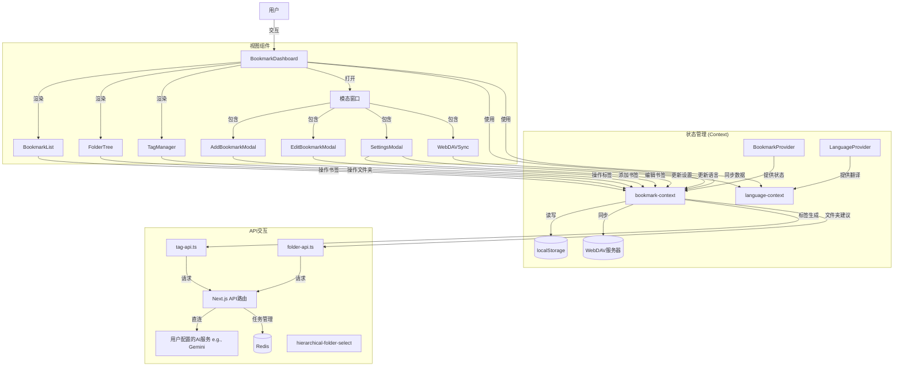

# MarkHub - 现代书签管理应用

MarkHub 是一个功能全面的现代书签管理应用，结合了本地存储的便捷性和云同步的灵活性。通过良好的架构设计和性能优化，能够高效处理大量的书签数据。

[English Version](README_EN.md)

## 快速开始

### 官方网站

MarkHub已部署官方站点，访问 [markhub.app](https://markhub.app) 即可开始使用，无需安装。

### Chrome扩展

我们提供Chrome浏览器扩展，方便您在浏览任何网页时一键添加书签到MarkHub：

- 功能：直接从任何网页添加书签，快速打开MarkHub官方网站
- 兼容性：目前仅支持与官方站点协作使用
- 下载方式：
  - [直接下载链接](https://github.com/Syferie/MarkHub/releases/download/v1.0/markhub-extension.zip)
  - 或在GitHub项目的Releases页面下载

## 技术栈

项目基于现代前端技术栈构建：

- **核心框架**: Next.js 15.2.4 (React 19)
- **语言**: TypeScript
- **样式**: Tailwind CSS 和 Mantine 组件库
- **UI 组件**: Radix UI、Mantine Core
- **状态管理**: React Context API
- **数据存储**: IndexedDB（本地浏览器数据库）
- **性能优化**: 虚拟列表渲染 (react-window, react-virtualized-auto-sizer)
- **搜索功能**: Fuse.js（模糊搜索）
- **表单处理**: react-hook-form 和 zod 验证
- **国际化**: React Context API 实现多语言支持

## 核心功能

### 1. 书签管理

- 添加、编辑、删除书签
- 书签分类（文件夹、标签）
- 收藏功能（标星）
- 批量操作（批量编辑、删除、收藏）

### 2. 组织功能

- **文件夹系统**: 层级文件夹结构
- **标签系统**: 多标签分类
- **收藏夹**: 快速访问常用书签和文件夹

### 3. 搜索和过滤

- 模糊搜索（基于 Fuse.js）
- 多字段搜索（标题、URL、标签）
- 按文件夹和标签过滤
- 多种排序选项（时间、字母顺序等）

### 4. 数据同步

- **WebDAV 同步**: 与 WebDAV 服务器双向同步
- **导入/导出**: JSON 格式的书签数据导入导出

### 5. AI 智能标签生成

- 通过用户在应用设置中配置的AI服务（支持OpenAI兼容接口）自动为书签生成标签建议。
- **智能匹配现有标签**：AI 只会从应用中已有的标签集合中推荐标签，确保分类系统的一致性和整洁性。
- 不会创建新标签，避免标签体系混乱，保持用户已建立的组织结构。
- 异步任务处理模式：通过Next.js API路由提交任务，使用Redis管理任务队列和状态，前端轮询获取结果。
- 网页内容提取：优先直接抓取，失败时自动回退到备用内容提取API (感谢公益 API 服务`https://api.pearktrue.cn/api/llmreader/`)。
- 用户界面集成：
  - 在添加/编辑书签的模态框中通过 "AI Suggest Tags" 按钮使用。
  - 在书签列表的批量编辑操作中选择 "Generate Tags (AI)" 选项。
- **配置方式**：
  - 用户需要在应用的"设置"面板中配置AI服务API密钥。系统默认使用平衡性能与价格的模型配置。
  - 这些配置安全地存储在本地浏览器的 `IndexedDB` 中，不会向云端传输，确保数据安全。

### 6. AI 智能文件夹推荐

- 通过支持OpenAI兼容接口的AI服务，基于书签内容智能推荐合适的文件夹名称。
- **智能匹配现有文件夹**：AI 只会从用户已创建的文件夹结构中进行推荐，不会创建新的文件夹。
- 保持文件夹结构的一致性，避免创建冗余或不必要的文件夹。
- 帮助用户在保持现有组织结构的同时，快速对新书签进行分类。
- 支持单个书签和批量书签处理。
- 异步任务处理模式：通过Next.js API路由提交任务，使用Redis管理任务队列和状态，前端轮询获取结果。
- 网页内容提取：与标签生成功能采用相同的提取和回退机制。
- 用户界面集成：
  - 在添加/编辑书签的模态框中通过 "AI Suggest Folder" 按钮使用。
  - 在书签列表的批量编辑操作中选择 "Suggest Folder (AI)" 选项。
- **配置方式**：
  - 与AI智能标签生成功能共享相同的API配置，在设置面板中统一管理，所有信息安全存储在本地。

### 7. 多语言支持 (i18n)

- 支持英文和中文两种语言
- 通过 React Context API 实现语言切换功能
- 所有界面文本均支持多语言
- 用户界面集成：
  - 在设置面板中可以切换应用语言
  - 语言设置保存在 IndexedDB 中
- 技术实现：
  - 语言上下文：`context/language-context.tsx`
  - 翻译数据存储在上下文中
  - 提供 `t()` 函数用于文本翻译

### 8. 设置和个性化

- 深色/浅色模式
- 主题色自定义
- 默认视图设置
- API 配置（标签生成、文件夹推荐）
- 语言偏好设置

## 架构设计

### 1. 状态管理

项目使用 React Context API 进行状态管理，在 `BookmarkProvider` 中集中管理所有书签相关数据：

- 书签数据
- 文件夹结构
- 标签集合
- 用户偏好和设置
- 过滤和排序逻辑

### 2. 数据持久化

- 使用 IndexedDB 存储数据，支持更大容量和结构化查询
- 创建书签、文件夹和设置的对象存储
- 为常用查询建立索引，提高性能
- 支持从 localStorage 迁移数据
- 使用防抖函数减少频繁存储操作
- WebDAV 同步实现云存储

### 3. 组件结构

- **布局组件**: `app/layout.tsx`、`BookmarkDashboard`
- **功能组件**: 书签列表、文件夹树、标签管理器
- **模态窗口**: 添加/编辑书签、设置、WebDAV 同步
- **UI 组件**: 大量来自 Radix UI 的可访问性组件

```
组件层次结构:
└── app/
    ├── layout.tsx (全局布局)
    └── page.tsx (主页)
        └── BookmarkDashboard (主面板)
            ├── FolderTree (文件夹树)
            ├── BookmarkList (书签列表)
            ├── TagManager (标签管理)
            └── 各种模态窗口
                ├── AddBookmarkModal
                ├── EditBookmarkModal
                ├── SettingsModal
                └── WebDAVSyncModal
```

### 4. 性能优化

- 虚拟列表渲染处理大量书签
- React.memo 减少不必要的重渲染
- 组件分割和按需加载
- 优化的 WebPack 配置（代码分割、缓存组）

### 5. API 交互

- **AI 功能 API (标签生成、文件夹推荐)**: 通过 Next.js API 路由与支持OpenAI兼容接口的AI服务进行交互，使用Redis进行异步任务管理，默认采用经济与性能平衡的配置。
- **WebDAV API**: 直接从前端与 WebDAV 服务器通信

### 6. 程序架构图

以下是 MarkHub 应用程序的架构图，显示了主要组件之间的数据流和交互关系：



## 项目结构

以下是 MarkHub 项目的主要文件和文件夹结构：

```
markhub/
├── app/                      # Next.js 应用程序目录
│   ├── api/                  # API 路由
│   │   ├── generate-tags/    # 标签生成 API (直连AI服务)
│   │   └── suggest-folder/   # 文件夹建议 API (直连AI服务)
│   ├── layout.tsx            # 全局布局组件
│   ├── page.tsx              # 主页组件
│   ├── background.js         # 背景脚本
│   ├── globals.css           # 全局样式
│   └── manifest.json         # 应用清单
│
├── components/               # React 组件
│   ├── add-bookmark-modal.tsx        # 添加书签模态窗口
│   ├── bookmark-dashboard.tsx        # 主面板组件
│   ├── bookmark-list.tsx             # 书签列表组件
│   ├── edit-bookmark-modal.tsx       # 编辑书签模态窗口
│   ├── folder-tree.tsx               # 文件夹树组件
│   ├── hierarchical-folder-select.tsx # 层级文件夹选择器
│   ├── import-export.tsx             # 导入导出功能
│   ├── settings-modal.tsx            # 设置模态窗口
│   ├── tag-manager.tsx               # 标签管理组件
│   ├── theme-provider.tsx            # 主题提供器
│   ├── webdav-sync.tsx               # WebDAV 同步组件
│   ├── ai-classification-indicator.tsx # AI 分类状态指示器
│   └── ui/                           # UI 组件库
│
├── context/                  # React Context
│   ├── bookmark-context.tsx  # 书签上下文/状态管理
│   ├── language-context.tsx  # 语言上下文/国际化
│   └── ai-classification-context.tsx # AI分类上下文
│
├── hooks/                    # 自定义 React Hooks
│   ├── use-mobile.tsx        # 移动设备检测
│   └── use-toast.ts          # 通知提示
│
├── lib/                      # 工具库
│   ├── folder-api.ts         # 文件夹建议 API 客户端
│   ├── tag-api.ts            # 标签生成 API 客户端
│   ├── db.ts                 # IndexedDB 数据库操作
│   └── utils.ts              # 通用工具函数
│
├── public/                   # 静态资源
│   ├── placeholder-logo.png  # 占位图标
│   └── placeholder.svg       # 占位图形
│
├── types/                    # TypeScript 类型定义
│   └── index.d.ts            # 全局类型定义
├── types.tsx                 # 项目类型定义
│
└── ... 配置文件 ...          # 项目配置文件
```

## 架构分析

MarkHub 书签管理器采用了清晰的分层架构设计，主要包括以下几个核心部分：

1. **状态管理层**：基于 React Context API 构建，通过 `BookmarkProvider` 和 `LanguageProvider` 集中管理应用状态。这种集中式状态管理使得数据流向清晰可控，各组件可以方便地访问和修改共享状态，而不需要复杂的属性传递。

2. **视图层**：由 `BookmarkDashboard` 作为主容器，包含多个功能性组件如 `BookmarkList`、`FolderTree` 和 `TagManager`。这些组件负责数据的可视化展示和用户交互，它们通过 Context 与状态层通信，实现了视图和数据的解耦。

3. **API 交互层**：通过 Next.js API 路由实现对外部服务的代理请求，包括标签生成和文件夹推荐功能。`tag-api.ts` 和 `folder-api.ts` 提供了一组与后端通信的函数，采用任务提交和状态轮询的模式，有效处理异步操作。

4. **数据持久化**：实现了多种数据存储策略，包括本地存储（localStorage）和云同步（WebDAV）。对大型数据集进行了分块存储优化，并使用防抖函数减少频繁写入操作，提高性能和用户体验。

5. **UI交互优化**：采用模态窗口处理复杂表单操作，并通过虚拟列表技术（react-window）实现高性能的长列表渲染，即使在处理大量书签数据时也能保持流畅的用户体验。

6. **国际化支持**：通过 `LanguageProvider` 提供多语言支持，实现了应用界面的无缝语言切换，提升了用户体验和国际化能力。

整体架构遵循了组件化、模块化的设计原则，各部分职责明确，耦合度低，便于维护和扩展。特别是 API 设计采用了异步任务处理模式，使得系统可以更好地处理网络延迟和服务端计算密集型操作。

## 项目特点

1. **模块化设计**: 功能被清晰地分割成独立的组件和模块
2. **性能关注**: 针对大量书签数据的处理进行了多种优化
3. **用户体验**: 丰富的UI组件和交互，包括拖放、模态窗口、进度指示等
4. **可扩展性**: 清晰的数据结构和组件设计便于功能扩展
5. **云同步**: 支持通过 WebDAV 在多设备间同步数据
6. **AI辅助**: 智能标签生成和文件夹推荐功能提升用户效率
7. **多语言支持**: 内置的国际化功能让应用面向全球用户
8. **移动端适配**: 针对移动设备优化的响应式设计，包括：
   - 自适应布局：在小屏幕设备上使用标签页切换布局而非网格布局
   - 触摸友好界面：优化按钮大小和间距，便于触摸操作
   - 文件夹树优化：简化移动端文件夹操作方式
   - 书签列表优化：改进卡片布局，确保在小屏幕上有更好的可读性

## 数据流

```
用户操作 → 组件事件处理 → Context Actions → 状态更新 → 组件重渲染 → IndexedDB 存储 → (可选) WebDAV 同步
```

## 开发与部署

### 本地开发

本项目使用 Next.js 框架，可通过以下命令运行：

```bash
# 安装依赖
npm install
# 或
pnpm install

# 配置环境变量
cp .env.example .env
# 然后编辑 .env 文件，填入您的 Redis 连接URL (REDIS_URL)。

# 开发模式
npm run dev
# 或
pnpm dev

# 构建项目
npm run build
# 或
pnpm build

# 运行构建后的项目
npm run start
# 或
pnpm start
```

### Docker 部署

MarkHub 支持使用 Docker 快速部署，我们提供了 Dockerfile 和 docker-compose.yml 配置文件，轻松实现一键部署。

#### 使用 Docker Compose 部署（推荐）

1. 克隆仓库并进入项目目录
   ```bash
   git clone https://github.com/yourusername/markhub.git
   cd markhub
   ```

2. 启动服务
   ```bash
   docker-compose up -d
   ```

3. 访问应用
   ```
   http://localhost:3000
   ```

这将启动两个容器：
- MarkHub 应用（Next.js）- 在3000端口提供服务
- Redis服务 - 用于AI任务队列管理（不对外暴露端口）

#### Docker 配置特点
  
- **安全加强**:
  - 应用使用非root用户运行
  - Redis不暴露外部端口
  - 内置健康检查

- **简化配置**:
  - 所有必要的环境变量已在docker-compose.yml中设置
  - 无需手动配置.env文件
  - Redis数据持久化已配置，确保数据不会丢失

#### 自定义部署

如需自定义部署配置，可以编辑docker-compose.yml文件，例如修改端口映射或调整资源限制：

```yaml
# 修改端口映射示例
ports:
  - "8080:3000"  # 将应用映射到8080端口
```

### 环境变量配置

项目使用环境变量来存储敏感信息和配置项。在直接部署时，请确保设置以下环境变量：

#### 必需的环境变量

- `NEXT_PUBLIC_API_BASE_URL`: (推荐) 后端API基础URL
  - 开发环境: `http://127.0.0.1:8090`
  - 生产环境: `https://your-production-api.com`

#### 环境变量配置步骤

1. **开发环境配置**
   
   复制项目根目录的 `.env.example` 文件为 `.env`：
   ```bash
   cp .env.example .env
   ```
   
   然后根据需要修改其中的值，例如：
   ```env
   # 后端API基础URL - 开发环境
   NEXT_PUBLIC_API_BASE_URL=http://127.0.0.1:8090
   ```

2. **生产环境配置**
   
   根据您的实际后端服务地址设置：
   ```env
   # 后端API基础URL - 生产环境
   NEXT_PUBLIC_API_BASE_URL=https://your-production-api.com
   ```

3. **验证配置**
   
   启动开发服务器后，在浏览器开发者工具的控制台中检查网络请求，确认API请求指向正确的后端地址。

> **注意**: 
> - `.env` 文件会被 Git 忽略，不会提交到版本控制系统
> - 环境变量名以 `NEXT_PUBLIC_` 开头，可以在客户端代码中使用
> - 如果不设置 `NEXT_PUBLIC_API_BASE_URL`，应用会默认使用 `http://127.0.0.1:8090`
> - 修改环境变量后需要重启开发服务器
> - 使用Docker Compose部署时，环境变量已在配置文件中预设，无需额外配置

## 许可证

MarkHub 使用 CC BY-NC 4.0 (知识共享署名-非商业性使用 4.0 国际) 许可证。主要内容如下：

- 允许分享和改编本项目
- 必须提供适当的署名
- 禁止将本项目用于商业目的
- 对于面向其他用户的二次开发版本：
  - 必须保持开源
  - 必须在用户界面和文档中明确标明是基于 MarkHub 的衍生作品
  - 必须包含指向原项目的链接
  - 必须使用相同的许可条款

详细条款请查看 [LICENSE](LICENSE) 文件或访问 [CC BY-NC 4.0 许可证](https://creativecommons.org/licenses/by-nc/4.0/)。

---

MarkHub 是一个功能丰富的书签管理解决方案，通过精心的架构设计和性能优化，为用户提供了强大而流畅的书签管理体验。