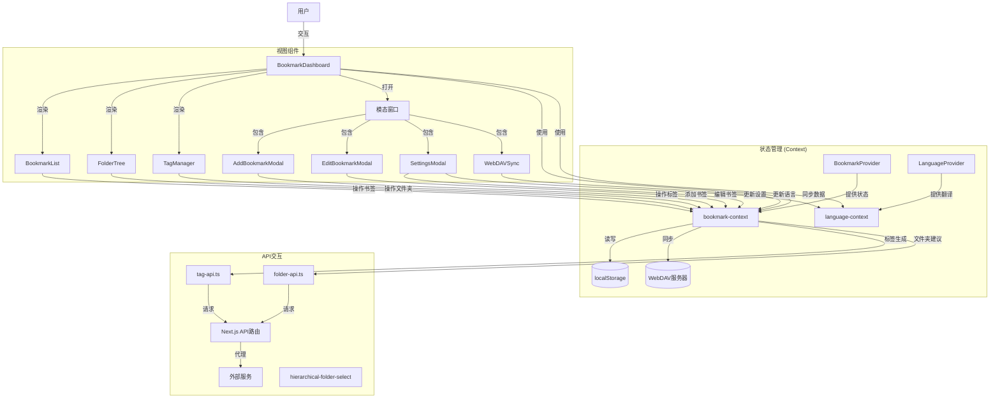

# MarkHub - 现代书签管理应用

MarkHub 是一个功能全面的现代书签管理应用，结合了本地存储的便捷性和云同步的灵活性。通过良好的架构设计和性能优化，能够高效处理大量的书签数据。

[English Version](README_EN.md)

## 技术栈

项目基于现代前端技术栈构建：

- **核心框架**: Next.js 15.2.4 (React 19)
- **语言**: TypeScript
- **样式**: Tailwind CSS 和 Mantine 组件库
- **UI 组件**: Radix UI、Mantine Core
- **状态管理**: React Context API
- **数据存储**: localStorage（本地存储）
- **性能优化**: 虚拟列表渲染 (react-window, react-virtualized-auto-sizer)
- **搜索功能**: Fuse.js（模糊搜索）
- **表单处理**: react-hook-form 和 zod 验证
- **国际化**: React Context API 实现多语言支持

## 核心功能

### 1. 书签管理

- 添加、编辑、删除书签
- 书签分类（文件夹、标签）
- 收藏功能（标星）
- 批量操作（批量编辑、删除、收藏）

### 2. 组织功能

- **文件夹系统**: 层级文件夹结构
- **标签系统**: 多标签分类
- **收藏夹**: 快速访问常用书签和文件夹

### 3. 搜索和过滤

- 模糊搜索（基于 Fuse.js）
- 多字段搜索（标题、URL、标签）
- 按文件夹和标签过滤
- 多种排序选项（时间、字母顺序等）

### 4. 数据同步

- **WebDAV 同步**: 与 WebDAV 服务器双向同步
- **导入/导出**: JSON 格式的书签数据导入导出

### 5. AI 智能标签生成

- 通过外部 API 自动为书签生成标签建议
- 异步任务处理模式（任务提交、状态轮询）
- 用户界面集成：
  - 在添加/编辑书签的模态框中通过 "AI Suggest Tags" 按钮使用
  - 在书签列表的批量编辑操作中选择 "Generate Tags (AI)" 选项
- 技术实现：
  - 后端 API 路由：`app/api/generate-tags/route.ts`
  - 前端 API 客户端：`lib/tag-api.ts`

### 6. AI 智能文件夹推荐

- 基于书签内容智能推荐合适的文件夹名称
- 支持单个书签和批量书签处理
- 用户界面集成：
  - 在添加/编辑书签的模态框中通过 "AI Suggest Folder" 按钮使用
  - 在书签列表的批量编辑操作中选择 "Suggest Folder (AI)" 选项
- 技术实现：
  - 后端 API 路由：`app/api/suggest-folder/route.ts`
  - 前端 API 客户端：`lib/folder-api.ts`

### 7. 多语言支持 (i18n)

- 支持英文和中文两种语言
- 通过 React Context API 实现语言切换功能
- 所有界面文本均支持多语言
- 用户界面集成：
  - 在设置面板中可以切换应用语言
  - 语言设置保存在 IndexedDB 中
- 技术实现：
  - 语言上下文：`context/language-context.tsx`
  - 翻译数据存储在上下文中
  - 提供 `t()` 函数用于文本翻译

### 8. 设置和个性化

- 深色/浅色模式
- 主题色自定义
- 默认视图设置
- API 配置（标签生成、文件夹推荐）
- 语言偏好设置

## 架构设计

### 1. 状态管理

项目使用 React Context API 进行状态管理，在 `BookmarkProvider` 中集中管理所有书签相关数据：

- 书签数据
- 文件夹结构
- 标签集合
- 用户偏好和设置
- 过滤和排序逻辑

### 2. 数据持久化

- 使用 localStorage 存储数据
- 针对大型数据集进行分块存储优化
- 使用防抖函数减少频繁存储操作
- WebDAV 同步实现云存储

### 3. 组件结构

- **布局组件**: `app/layout.tsx`、`BookmarkDashboard`
- **功能组件**: 书签列表、文件夹树、标签管理器
- **模态窗口**: 添加/编辑书签、设置、WebDAV 同步
- **UI 组件**: 大量来自 Radix UI 的可访问性组件

```
组件层次结构:
└── app/
    ├── layout.tsx (全局布局)
    └── page.tsx (主页)
        └── BookmarkDashboard (主面板)
            ├── FolderTree (文件夹树)
            ├── BookmarkList (书签列表)
            ├── TagManager (标签管理)
            └── 各种模态窗口
                ├── AddBookmarkModal
                ├── EditBookmarkModal
                ├── SettingsModal
                └── WebDAVSyncModal
```

### 4. 性能优化

- 虚拟列表渲染处理大量书签
- React.memo 减少不必要的重渲染
- 组件分割和按需加载
- 优化的 WebPack 配置（代码分割、缓存组）

### 5. API 交互

- **标签生成 API**: 通过 Next.js API 路由代理到外部服务
- **文件夹推荐 API**: 通过 Next.js API 路由代理到外部服务
- **WebDAV API**: 直接从前端与 WebDAV 服务器通信

### 6. 程序架构图

以下是 MarkHub 应用程序的架构图，显示了主要组件之间的数据流和交互关系：



## 项目结构

以下是 MarkHub 项目的主要文件和文件夹结构：

```
markhub/
├── app/                      # Next.js 应用程序目录
│   ├── api/                  # API 路由
│   │   ├── generate-tags/    # 标签生成 API 代理
│   │   └── suggest-folder/   # 文件夹建议 API
│   ├── layout.tsx            # 全局布局组件
│   ├── page.tsx              # 主页组件
│   ├── background.js         # 背景脚本
│   ├── globals.css           # 全局样式
│   └── manifest.json         # 应用清单
│
├── components/               # React 组件
│   ├── add-bookmark-modal.tsx        # 添加书签模态窗口
│   ├── bookmark-dashboard.tsx        # 主面板组件
│   ├── bookmark-list.tsx             # 书签列表组件
│   ├── edit-bookmark-modal.tsx       # 编辑书签模态窗口
│   ├── folder-tree.tsx               # 文件夹树组件
│   ├── hierarchical-folder-select.tsx # 层级文件夹选择器
│   ├── import-export.tsx             # 导入导出功能
│   ├── settings-modal.tsx            # 设置模态窗口
│   ├── tag-manager.tsx               # 标签管理组件
│   ├── theme-provider.tsx            # 主题提供器
│   ├── webdav-sync.tsx               # WebDAV 同步组件
│   ├── ai-classification-indicator.tsx # AI 分类状态指示器
│   └── ui/                           # UI 组件库
│
├── context/                  # React Context
│   ├── bookmark-context.tsx  # 书签上下文/状态管理
│   ├── language-context.tsx  # 语言上下文/国际化
│   └── ai-classification-context.tsx # AI分类上下文
│
├── hooks/                    # 自定义 React Hooks
│   ├── use-mobile.tsx        # 移动设备检测
│   └── use-toast.ts          # 通知提示
│
├── lib/                      # 工具库
│   ├── folder-api.ts         # 文件夹建议 API 客户端
│   ├── tag-api.ts            # 标签生成 API 客户端
│   ├── db.ts                 # 数据库操作
│   └── utils.ts              # 通用工具函数
│
├── public/                   # 静态资源
│   ├── placeholder-logo.png  # 占位图标
│   └── placeholder.svg       # 占位图形
│
├── types/                    # TypeScript 类型定义
│   └── index.d.ts            # 全局类型定义
├── types.tsx                 # 项目类型定义
│
└── ... 配置文件 ...          # 项目配置文件
```

## 架构分析

MarkHub 书签管理器采用了清晰的分层架构设计，主要包括以下几个核心部分：

1. **状态管理层**：基于 React Context API 构建，通过 `BookmarkProvider` 和 `LanguageProvider` 集中管理应用状态。这种集中式状态管理使得数据流向清晰可控，各组件可以方便地访问和修改共享状态，而不需要复杂的属性传递。

2. **视图层**：由 `BookmarkDashboard` 作为主容器，包含多个功能性组件如 `BookmarkList`、`FolderTree` 和 `TagManager`。这些组件负责数据的可视化展示和用户交互，它们通过 Context 与状态层通信，实现了视图和数据的解耦。

3. **API 交互层**：通过 Next.js API 路由实现对外部服务的代理请求，包括标签生成和文件夹推荐功能。`tag-api.ts` 和 `folder-api.ts` 提供了一组与后端通信的函数，采用任务提交和状态轮询的模式，有效处理异步操作。

4. **数据持久化**：实现了多种数据存储策略，包括本地存储（localStorage）和云同步（WebDAV）。对大型数据集进行了分块存储优化，并使用防抖函数减少频繁写入操作，提高性能和用户体验。

5. **UI交互优化**：采用模态窗口处理复杂表单操作，并通过虚拟列表技术（react-window）实现高性能的长列表渲染，即使在处理大量书签数据时也能保持流畅的用户体验。

6. **国际化支持**：通过 `LanguageProvider` 提供多语言支持，实现了应用界面的无缝语言切换，提升了用户体验和国际化能力。

整体架构遵循了组件化、模块化的设计原则，各部分职责明确，耦合度低，便于维护和扩展。特别是 API 设计采用了异步任务处理模式，使得系统可以更好地处理网络延迟和服务端计算密集型操作。

## 项目特点

1. **模块化设计**: 功能被清晰地分割成独立的组件和模块
2. **性能关注**: 针对大量书签数据的处理进行了多种优化
3. **用户体验**: 丰富的UI组件和交互，包括拖放、模态窗口、进度指示等
4. **可扩展性**: 清晰的数据结构和组件设计便于功能扩展
5. **云同步**: 支持通过 WebDAV 在多设备间同步数据
6. **AI辅助**: 智能标签生成和文件夹推荐功能提升用户效率
7. **多语言支持**: 内置的国际化功能让应用面向全球用户

## 数据流

```
用户操作 → 组件事件处理 → Context Actions → 状态更新 → 组件重渲染 → localStorage 存储 → (可选) WebDAV 同步
```

## 开发与部署

本项目使用 Next.js 框架，可通过以下命令运行：

```bash
# 安装依赖
npm install
# 或
pnpm install

# 开发模式
npm run dev
# 或
pnpm dev

# 构建项目
npm run build
# 或
pnpm build

# 运行构建后的项目
npm run start
# 或
pnpm start
```

---

MarkHub 是一个功能丰富的书签管理解决方案，通过精心的架构设计和性能优化，为用户提供了强大而流畅的书签管理体验。