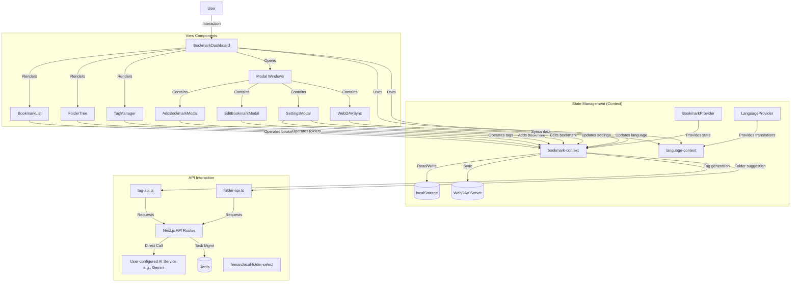

# MarkHub - Modern Bookmark Management Application

MarkHub is a comprehensive modern bookmark management application that combines the convenience of local storage with the flexibility of cloud synchronization. Through excellent architectural design and performance optimization, it can efficiently handle large amounts of bookmark data.

[中文版本](README.md)

## Quick Start

### Official Website

MarkHub is deployed on an official website. Visit [markhub.app](https://markhub.app) to start using it immediately without installation.

### Chrome Extension

We offer a Chrome browser extension that makes it easy to add bookmarks to MarkHub while browsing any webpage:

- Features: Add bookmarks directly from any webpage, quickly open the MarkHub official website
- Compatibility: Currently only works with the official website
- Download options:
  - [Direct download link](https://github.com/Syferie/MarkHub/releases/download/v1.0/markhub-extension.zip)
  - Or download from the Releases page on GitHub

## Tech Stack

The project is built on a modern front-end technology stack:

- **Core Framework**: Next.js 15.2.4 (React 19)
- **Language**: TypeScript
- **Styling**: Tailwind CSS and Mantine component library
- **UI Components**: Radix UI, Mantine Core
- **State Management**: React Context API
- **Data Storage**: IndexedDB (local browser database)
- **Performance Optimization**: Virtual list rendering (react-window, react-virtualized-auto-sizer)
- **Search Functionality**: Fuse.js (fuzzy search)
- **Form Handling**: react-hook-form and zod validation
- **Internationalization**: React Context API for multi-language support

## Core Features

### 1. Bookmark Management

- Add, edit, delete bookmarks
- Bookmark categorization (folders, tags)
- Favorites function (starring)
- Bulk operations (bulk edit, delete, favorite)

### 2. Organization Features

- **Folder System**: Hierarchical folder structure
- **Tag System**: Multi-tag classification
- **Favorites**: Quick access to frequently used bookmarks and folders

### 3. Search and Filtering

- Fuzzy search (based on Fuse.js)
- Multi-field search (title, URL, tags)
- Filter by folders and tags
- Multiple sorting options (time, alphabetical order, etc.)

### 4. Data Synchronization

- **WebDAV Sync**: Two-way synchronization with WebDAV servers
- **Import/Export**: Import and export bookmark data in JSON format

### 5. AI Smart Tag Generation

- Automatically generates tag suggestions for bookmarks via an AI service (supporting OpenAI compatible interfaces) configured by the user in the application settings.
- **Smart matching with existing tags**: AI only recommends tags from the existing tag collection in the application, ensuring consistency and tidiness of the classification system.
- Does not create new tags, avoiding tag system chaos and maintaining the organizational structure established by the user.
- Asynchronous task processing model: Tasks are submitted via Next.js API routes, using Redis to manage task queues and statuses, with the frontend polling for results.
- Web content extraction: Prioritizes direct fetching; automatically falls back to a backup content extraction API (Thanks to the public welfare API service`https://api.pearktrue.cn/api/llmreader/`).
- User interface integration:
  - Use via "AI Suggest Tags" button in the add/edit bookmark modal.
  - Select "Generate Tags (AI)" option in bulk edit operations in the bookmark list.
- **Configuration**:
  - Users need to configure AI service API Key in the application's "Settings" panel. The system defaults to using a model configuration that balances performance and cost.
  - These configurations are securely stored in the local browser's `IndexedDB` and are not transmitted to the cloud, ensuring data security.

### 6. AI Smart Folder Recommendation

- Intelligently recommends appropriate folder names based on bookmark content via AI services supporting OpenAI compatible interfaces.
- **Smart matching with existing folders**: AI only recommends from the folder structure already created by the user, without creating new folders.
- Maintains consistency of folder structure, avoiding creation of redundant or unnecessary folders.
- Helps users quickly categorize new bookmarks while maintaining existing organizational structure.
- Support for single bookmark and bulk bookmark processing.
- Asynchronous task processing model: Uses Next.js API routes for task submission, Redis for task queue and status management, and frontend polling for results.
- Web content extraction: Employs the same extraction and fallback mechanism as the tag generation feature.
- User interface integration:
  - Use via "AI Suggest Folder" button in the add/edit bookmark modal.
  - Select "Suggest Folder (AI)" option in bulk edit operations in the bookmark list.
- **Configuration**:
  - Shares the same API configuration as the AI Smart Tag Generation feature, managed uniformly in the settings panel, with all information securely stored locally.

### 7. Multi-language Support (i18n)

- Support for English and Chinese languages
- Language switching functionality implemented via React Context API
- All interface text supports multiple languages
- User interface integration:
  - Switch application language in the settings panel
  - Language settings saved in IndexedDB
- Technical implementation:
  - Language context: `context/language-context.tsx`
  - Translation data stored in context
  - Provides `t()` function for text translation

### 8. Settings and Personalization

- Dark/Light mode
- Custom theme colors
- Default view settings
- API configuration (tag generation, folder recommendation)
- Language preference settings

## Architecture Design

### 1. State Management

The project uses React Context API for state management, centralizing all bookmark-related data in `BookmarkProvider`:

- Bookmark data
- Folder structure
- Tag collection
- User preferences and settings
- Filtering and sorting logic

### 2. Data Persistence

- Uses IndexedDB for data storage, supporting larger capacity and structured queries
- Creates object stores for bookmarks, folders, and settings
- Establishes indexes for common queries to improve performance
- Supports data migration from localStorage
- Uses debounce functions to reduce frequent storage operations
- WebDAV synchronization for cloud storage

### 3. Component Structure

- **Layout Components**: `app/layout.tsx`, `BookmarkDashboard`
- **Functional Components**: Bookmark list, folder tree, tag manager
- **Modal Windows**: Add/edit bookmark, settings, WebDAV sync
- **UI Components**: Numerous accessibility components from Radix UI

```
Component hierarchy:
└── app/
    ├── layout.tsx (Global layout)
    └── page.tsx (Main page)
        └── BookmarkDashboard (Main panel)
            ├── FolderTree (Folder tree)
            ├── BookmarkList (Bookmark list)
            ├── TagManager (Tag management)
            └── Various modal windows
                ├── AddBookmarkModal
                ├── EditBookmarkModal
                ├── SettingsModal
                └── WebDAVSyncModal
```

### 4. Performance Optimization

- Virtual list rendering to handle large numbers of bookmarks
- React.memo to reduce unnecessary re-renders
- Component splitting and on-demand loading
- Optimized WebPack configuration (code splitting, cache groups)

### 5. API Interaction

- **AI Features API (Tag Generation, Folder Recommendation)**: Interacts with AI services supporting OpenAI compatible interfaces via Next.js API routes, using Redis for asynchronous task management, defaulting to a configuration that balances economy and performance.
- **WebDAV API**: Direct communication from frontend to WebDAV server

### 6. Architecture Diagram

The following is an architecture diagram of the MarkHub application, showing the data flow and interaction relationships between major components:



## Project Structure

The following is the main file and folder structure of the MarkHub project:

```
markhub/
├── app/                      # Next.js application directory
│   ├── api/                  # API routes
│   │   ├── generate-tags/    # Tag generation API (direct AI call)
│   │   └── suggest-folder/   # Folder suggestion API (direct AI call)
│   ├── layout.tsx            # Global layout component
│   ├── page.tsx              # Main page component
│   ├── background.js         # Background script
│   ├── globals.css           # Global styles
│   └── manifest.json         # Application manifest
│
├── components/               # React components
│   ├── add-bookmark-modal.tsx        # Add bookmark modal window
│   ├── bookmark-dashboard.tsx        # Main panel component
│   ├── bookmark-list.tsx             # Bookmark list component
│   ├── edit-bookmark-modal.tsx       # Edit bookmark modal window
│   ├── folder-tree.tsx               # Folder tree component
│   ├── hierarchical-folder-select.tsx # Hierarchical folder selector
│   ├── import-export.tsx             # Import/export functionality
│   ├── settings-modal.tsx            # Settings modal window
│   ├── tag-manager.tsx               # Tag management component
│   ├── theme-provider.tsx            # Theme provider
│   ├── webdav-sync.tsx               # WebDAV sync component
│   ├── ai-classification-indicator.tsx # AI classification status indicator
│   └── ui/                           # UI component library
│
├── context/                  # React Context
│   ├── bookmark-context.tsx  # Bookmark context/state management
│   ├── language-context.tsx  # Language context/internationalization
│   └── ai-classification-context.tsx # AI classification context
│
├── hooks/                    # Custom React Hooks
│   ├── use-mobile.tsx        # Mobile device detection
│   └── use-toast.ts          # Notification toast
│
├── lib/                      # Utility libraries
│   ├── folder-api.ts         # Folder suggestion API client
│   ├── tag-api.ts            # Tag generation API client
│   ├── db.ts                 # IndexedDB database operations
│   └── utils.ts              # Common utility functions
│
├── public/                   # Static resources
│   ├── placeholder-logo.png  # Placeholder icon
│   └── placeholder.svg       # Placeholder graphic
│
├── types/                    # TypeScript type definitions
│   └── index.d.ts            # Global type definitions
├── types.tsx                 # Project type definitions
│
└── ... Configuration files ... # Project configuration files
```

## Architecture Analysis

The MarkHub bookmark manager employs a clear layered architecture design, primarily including the following core parts:

1. **State Management Layer**: Built on React Context API, centrally managing application state through `BookmarkProvider` and `LanguageProvider`. This centralized state management makes data flow clear and controllable, allowing components to easily access and modify shared state without complex prop passing.

2. **View Layer**: With `BookmarkDashboard` as the main container, including multiple functional components such as `BookmarkList`, `FolderTree`, and `TagManager`. These components are responsible for data visualization and user interaction, communicating with the state layer through Context, achieving decoupling of view and data.

3. **API Interaction Layer**: Implementing proxy requests to external services through Next.js API routes, including tag generation and folder recommendation features. `tag-api.ts` and `folder-api.ts` provide a set of functions for communicating with the backend, adopting a task submission and status polling model, effectively handling asynchronous operations.

4. **Data Persistence**: Implementing multiple data storage strategies, including local storage (localStorage) and cloud synchronization (WebDAV). Optimized chunk storage for large datasets and using debounce functions to reduce frequent write operations, improving performance and user experience.

5. **UI Interaction Optimization**: Using modal windows to handle complex form operations, and implementing high-performance long list rendering through virtual list technology (react-window), maintaining a smooth user experience even when handling large amounts of bookmark data.

6. **Internationalization Support**: Providing multi-language support through `LanguageProvider`, enabling seamless language switching for the application interface, enhancing user experience and internationalization capabilities.

The overall architecture follows the principles of componentization and modularization, with clear responsibilities for each part, low coupling, and ease of maintenance and extension. The API design, in particular, adopts an asynchronous task processing model, allowing the system to better handle network latency and server-side compute-intensive operations.

## Project Features

1. **Modular Design**: Functions are clearly divided into independent components and modules
2. **Performance Focus**: Various optimizations for handling large amounts of bookmark data
3. **User Experience**: Rich UI components and interactions, including drag and drop, modal windows, progress indicators, etc.
4. **Extensibility**: Clear data structures and component design facilitate feature expansion
5. **Cloud Synchronization**: Support for synchronizing data across multiple devices via WebDAV
6. **AI Assistance**: Smart tag generation and folder recommendation features improve user efficiency
7. **Multi-language Support**: Built-in internationalization functionality makes the application accessible to global users
8. **Mobile Optimization**: Responsive design optimized for mobile devices, including:
   - Adaptive layout: Using tabbed interface on small screens instead of grid layout
   - Touch-friendly interface: Optimized button sizes and spacing for touch operations
   - Folder tree optimization: Simplified folder operations for mobile devices
   - Bookmark list improvements: Enhanced card layout for better readability on small screens

## Data Flow

```
User Operation → Component Event Handling → Context Actions → State Update → Component Re-rendering → IndexedDB Storage → (Optional) WebDAV Synchronization
```

## Development and Deployment

### Local Development

This project uses the Next.js framework and can be run using the following commands:

```bash
# Install dependencies
npm install
# or
pnpm install

# Configure Environment Variables
cp .env.example .env
# Then edit the .env file to add your Redis connection URL (REDIS_URL).

# Development mode
npm run dev
# or
pnpm dev

# Build project
npm run build
# or
pnpm build

# Run built project
npm run start
# or
pnpm start
```

### Docker Deployment

MarkHub supports quick deployment using Docker. We provide Dockerfile and docker-compose.yml configuration files for effortless one-click deployment.

#### Using Docker Compose (Recommended)

1. Clone the repository and navigate to the project directory
   ```bash
   git clone https://github.com/yourusername/markhub.git
   cd markhub
   ```

2. Start the services
   ```bash
   docker-compose up -d
   ```

3. Access the application
   ```
   http://localhost:3000
   ```

This will start two containers:
- MarkHub application (Next.js) - serving on port 3000
- Redis service - for AI task queue management (not exposed externally)

#### Docker Configuration Features

- **Optimized Resource Usage**: 
  - Application container memory limited to 512MB
  - Redis container memory limited to 256MB
  - Alpine base images to reduce container size
  
- **Enhanced Security**:
  - Application runs with non-root user
  - Redis does not expose external ports
  - Built-in health checks

- **Simplified Configuration**:
  - All necessary environment variables are set in docker-compose.yml
  - No need to manually configure .env file
  - Redis data persistence configured, ensuring data won't be lost

#### Custom Deployment

To customize deployment configuration, you can edit the docker-compose.yml file, such as modifying port mapping or adjusting resource limits:

```yaml
# Example of modified port mapping
ports:
  - "8080:3000"  # Map application to port 8080
```

### Environment Variables

The project uses environment variables to store sensitive information. When deploying directly, ensure you set the following environment variables:

- `REDIS_URL`: (Required) Redis database connection URL for AI-function asynchronous task state management. For example: `redis://localhost:6379`

> **Note**: When deploying with Docker Compose, environment variables are already preset in the configuration file, and no additional configuration is required.

## License

MarkHub is licensed under the CC BY-NC 4.0 (Creative Commons Attribution-NonCommercial 4.0 International) license. The main points are as follows:

- You are free to share and adapt the project
- You must provide appropriate attribution
- You may not use the material for commercial purposes
- For derivative versions intended for other users:
  - Must remain open source
  - Must clearly indicate in the user interface and documentation that it is a derivative work based on MarkHub
  - Must include a link to the original project
  - Must use the same license terms

For detailed terms, please see the [LICENSE](LICENSE) file or visit [CC BY-NC 4.0 License](https://creativecommons.org/licenses/by-nc/4.0/).

---

MarkHub is a feature-rich bookmark management solution that provides users with a powerful and smooth bookmark management experience through careful architectural design and performance optimization.