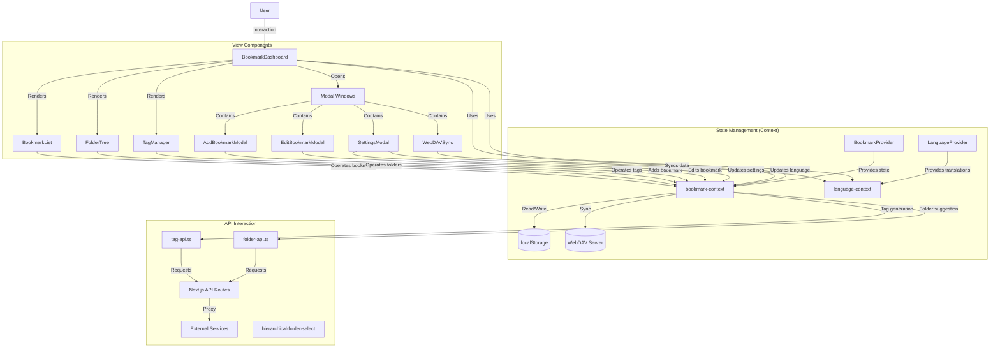

# MarkHub - Modern Bookmark Management Application

MarkHub is a comprehensive modern bookmark management application that combines the convenience of local storage with the flexibility of cloud synchronization. Through excellent architectural design and performance optimization, it can efficiently handle large amounts of bookmark data.

[中文版本](README.md)

## Tech Stack

The project is built on a modern front-end technology stack:

- **Core Framework**: Next.js 15.2.4 (React 19)
- **Language**: TypeScript
- **Styling**: Tailwind CSS and Mantine component library
- **UI Components**: Radix UI, Mantine Core
- **State Management**: React Context API
- **Data Storage**: localStorage (local storage)
- **Performance Optimization**: Virtual list rendering (react-window, react-virtualized-auto-sizer)
- **Search Functionality**: Fuse.js (fuzzy search)
- **Form Handling**: react-hook-form and zod validation
- **Internationalization**: React Context API for multi-language support

## Core Features

### 1. Bookmark Management

- Add, edit, delete bookmarks
- Bookmark categorization (folders, tags)
- Favorites function (starring)
- Bulk operations (bulk edit, delete, favorite)

### 2. Organization Features

- **Folder System**: Hierarchical folder structure
- **Tag System**: Multi-tag classification
- **Favorites**: Quick access to frequently used bookmarks and folders

### 3. Search and Filtering

- Fuzzy search (based on Fuse.js)
- Multi-field search (title, URL, tags)
- Filter by folders and tags
- Multiple sorting options (time, alphabetical order, etc.)

### 4. Data Synchronization

- **WebDAV Sync**: Two-way synchronization with WebDAV servers
- **Import/Export**: Import and export bookmark data in JSON format

### 5. AI Smart Tag Generation

- Automatically generate tag suggestions for bookmarks through an external API
- Asynchronous task processing model (task submission, status polling)
- User interface integration:
  - Use via "AI Suggest Tags" button in the add/edit bookmark modal
  - Select "Generate Tags (AI)" option in bulk edit operations in the bookmark list
- Technical implementation:
  - Backend API route: `app/api/generate-tags/route.ts`
  - Frontend API client: `lib/tag-api.ts`

### 6. AI Smart Folder Recommendation

- Intelligently recommend appropriate folder names based on bookmark content
- Support for single bookmark and bulk bookmark processing
- User interface integration:
  - Use via "AI Suggest Folder" button in the add/edit bookmark modal
  - Select "Suggest Folder (AI)" option in bulk edit operations in the bookmark list
- Technical implementation:
  - Backend API route: `app/api/suggest-folder/route.ts`
  - Frontend API client: `lib/folder-api.ts`

### 7. Multi-language Support (i18n)

- Support for English and Chinese languages
- Language switching functionality implemented via React Context API
- All interface text supports multiple languages
- User interface integration:
  - Switch application language in the settings panel
  - Language settings saved in IndexedDB
- Technical implementation:
  - Language context: `context/language-context.tsx`
  - Translation data stored in context
  - Provides `t()` function for text translation

### 8. Settings and Personalization

- Dark/Light mode
- Custom theme colors
- Default view settings
- API configuration (tag generation, folder recommendation)
- Language preference settings

## Architecture Design

### 1. State Management

The project uses React Context API for state management, centralizing all bookmark-related data in `BookmarkProvider`:

- Bookmark data
- Folder structure
- Tag collection
- User preferences and settings
- Filtering and sorting logic

### 2. Data Persistence

- Uses localStorage for data storage
- Chunk storage optimization for large datasets
- Uses debounce functions to reduce frequent storage operations
- WebDAV synchronization for cloud storage

### 3. Component Structure

- **Layout Components**: `app/layout.tsx`, `BookmarkDashboard`
- **Functional Components**: Bookmark list, folder tree, tag manager
- **Modal Windows**: Add/edit bookmark, settings, WebDAV sync
- **UI Components**: Numerous accessibility components from Radix UI

```
Component hierarchy:
└── app/
    ├── layout.tsx (Global layout)
    └── page.tsx (Main page)
        └── BookmarkDashboard (Main panel)
            ├── FolderTree (Folder tree)
            ├── BookmarkList (Bookmark list)
            ├── TagManager (Tag management)
            └── Various modal windows
                ├── AddBookmarkModal
                ├── EditBookmarkModal
                ├── SettingsModal
                └── WebDAVSyncModal
```

### 4. Performance Optimization

- Virtual list rendering to handle large numbers of bookmarks
- React.memo to reduce unnecessary re-renders
- Component splitting and on-demand loading
- Optimized WebPack configuration (code splitting, cache groups)

### 5. API Interaction

- **Tag Generation API**: Proxy to external service via Next.js API routes
- **Folder Recommendation API**: Proxy to external service via Next.js API routes
- **WebDAV API**: Direct communication from frontend to WebDAV server

### 6. Architecture Diagram

The following is an architecture diagram of the MarkHub application, showing the data flow and interaction relationships between major components:



## Project Structure

The following is the main file and folder structure of the MarkHub project:

```
markhub/
├── app/                      # Next.js application directory
│   ├── api/                  # API routes
│   │   ├── generate-tags/    # Tag generation API proxy
│   │   └── suggest-folder/   # Folder suggestion API
│   ├── layout.tsx            # Global layout component
│   ├── page.tsx              # Main page component
│   ├── background.js         # Background script
│   ├── globals.css           # Global styles
│   └── manifest.json         # Application manifest
│
├── components/               # React components
│   ├── add-bookmark-modal.tsx        # Add bookmark modal window
│   ├── bookmark-dashboard.tsx        # Main panel component
│   ├── bookmark-list.tsx             # Bookmark list component
│   ├── edit-bookmark-modal.tsx       # Edit bookmark modal window
│   ├── folder-tree.tsx               # Folder tree component
│   ├── hierarchical-folder-select.tsx # Hierarchical folder selector
│   ├── import-export.tsx             # Import/export functionality
│   ├── settings-modal.tsx            # Settings modal window
│   ├── tag-manager.tsx               # Tag management component
│   ├── theme-provider.tsx            # Theme provider
│   ├── webdav-sync.tsx               # WebDAV sync component
│   ├── ai-classification-indicator.tsx # AI classification status indicator
│   └── ui/                           # UI component library
│
├── context/                  # React Context
│   ├── bookmark-context.tsx  # Bookmark context/state management
│   ├── language-context.tsx  # Language context/internationalization
│   └── ai-classification-context.tsx # AI classification context
│
├── hooks/                    # Custom React Hooks
│   ├── use-mobile.tsx        # Mobile device detection
│   └── use-toast.ts          # Notification toast
│
├── lib/                      # Utility libraries
│   ├── folder-api.ts         # Folder suggestion API client
│   ├── tag-api.ts            # Tag generation API client
│   ├── db.ts                 # Database operations
│   └── utils.ts              # Common utility functions
│
├── public/                   # Static resources
│   ├── placeholder-logo.png  # Placeholder icon
│   └── placeholder.svg       # Placeholder graphic
│
├── types/                    # TypeScript type definitions
│   └── index.d.ts            # Global type definitions
├── types.tsx                 # Project type definitions
│
└── ... Configuration files ... # Project configuration files
```

## Architecture Analysis

The MarkHub bookmark manager employs a clear layered architecture design, primarily including the following core parts:

1. **State Management Layer**: Built on React Context API, centrally managing application state through `BookmarkProvider` and `LanguageProvider`. This centralized state management makes data flow clear and controllable, allowing components to easily access and modify shared state without complex prop passing.

2. **View Layer**: With `BookmarkDashboard` as the main container, including multiple functional components such as `BookmarkList`, `FolderTree`, and `TagManager`. These components are responsible for data visualization and user interaction, communicating with the state layer through Context, achieving decoupling of view and data.

3. **API Interaction Layer**: Implementing proxy requests to external services through Next.js API routes, including tag generation and folder recommendation features. `tag-api.ts` and `folder-api.ts` provide a set of functions for communicating with the backend, adopting a task submission and status polling model, effectively handling asynchronous operations.

4. **Data Persistence**: Implementing multiple data storage strategies, including local storage (localStorage) and cloud synchronization (WebDAV). Optimized chunk storage for large datasets and using debounce functions to reduce frequent write operations, improving performance and user experience.

5. **UI Interaction Optimization**: Using modal windows to handle complex form operations, and implementing high-performance long list rendering through virtual list technology (react-window), maintaining a smooth user experience even when handling large amounts of bookmark data.

6. **Internationalization Support**: Providing multi-language support through `LanguageProvider`, enabling seamless language switching for the application interface, enhancing user experience and internationalization capabilities.

The overall architecture follows the principles of componentization and modularization, with clear responsibilities for each part, low coupling, and ease of maintenance and extension. The API design, in particular, adopts an asynchronous task processing model, allowing the system to better handle network latency and server-side compute-intensive operations.

## Project Features

1. **Modular Design**: Functions are clearly divided into independent components and modules
2. **Performance Focus**: Various optimizations for handling large amounts of bookmark data
3. **User Experience**: Rich UI components and interactions, including drag and drop, modal windows, progress indicators, etc.
4. **Extensibility**: Clear data structures and component design facilitate feature expansion
5. **Cloud Synchronization**: Support for synchronizing data across multiple devices via WebDAV
6. **AI Assistance**: Smart tag generation and folder recommendation features improve user efficiency
7. **Multi-language Support**: Built-in internationalization functionality makes the application accessible to global users

## Data Flow

```
User Operation → Component Event Handling → Context Actions → State Update → Component Re-rendering → localStorage Storage → (Optional) WebDAV Synchronization
```

## Development and Deployment

This project uses the Next.js framework and can be run using the following commands:

```bash
# Install dependencies
npm install
# or
pnpm install

# Development mode
npm run dev
# or
pnpm dev

# Build project
npm run build
# or
pnpm build

# Run built project
npm run start
# or
pnpm start
```

---

MarkHub is a feature-rich bookmark management solution that provides users with a powerful and smooth bookmark management experience through careful architectural design and performance optimization.