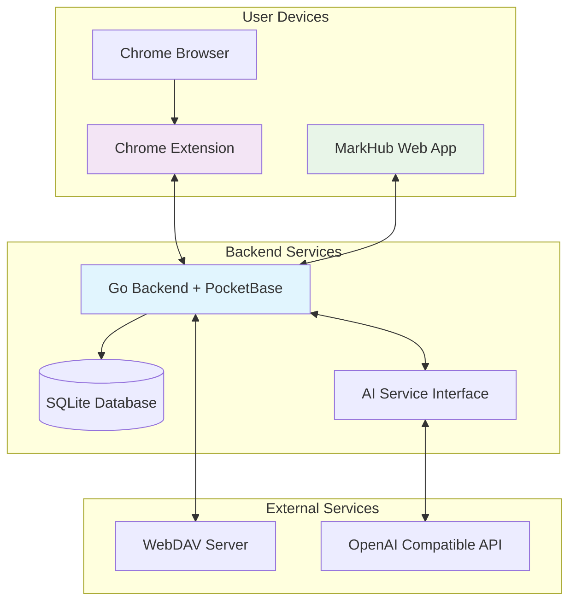
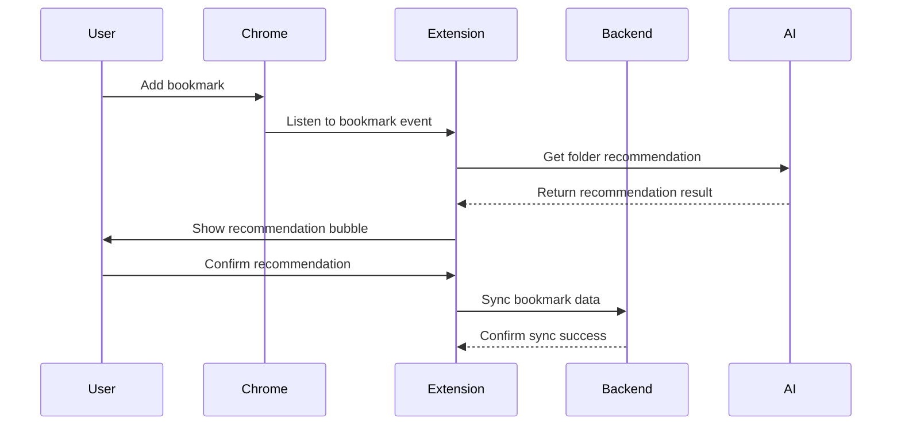

# MarkHub - Intelligent Bookmark Management Platform

MarkHub is a modern full-stack bookmark management platform that provides powerful AI-assisted features and complete multi-device synchronization experience. Through carefully designed architecture, it offers users an efficient and intelligent bookmark management solution.

[中文版本](README.md)

## Quick Start

### Local Deployment

#### Using Docker Compose (Recommended)

```bash
# Clone the project
git clone https://github.com/yourusername/markhub.git
cd markhub

# Start services
docker-compose up -d

# Access the application
# Frontend: http://localhost:3000
# Backend: http://localhost:8090
# Backend Admin Panel: http://localhost:8090/_/
```

#### Manual Deployment

```bash
# Backend service
cd backend
go run main.go serve

# Frontend service
cd frontend
npm install
npm run dev
```

### Chrome Extension Integration

We provide a fully-featured Chrome browser extension that supports intelligent bookmark management and bidirectional synchronization. This extension can be used independently:

- **Smart Adding**: AI folder recommendations, one-click bookmark addition (this feature works directly without login)
- **Bidirectional Sync**: Complete data synchronization between Chrome ↔ MarkHub
- **Real-time Updates**: Bookmark changes automatically sync to the cloud
- **Offline Work**: Supports offline addition, auto-sync when connected

## Technical Architecture

### Frontend Tech Stack

- **Core Framework**: Next.js 15.2.4 (React 19)
- **Language**: TypeScript
- **Styling**: Tailwind CSS + Radix UI
- **State Management**: React Context API
- **Performance Optimization**: Virtual list rendering, code splitting
- **Search Functionality**: Fuse.js fuzzy search
- **Internationalization**: Multi-language support (Chinese/English)

### Backend Tech Stack

- **Core Framework**: Go + PocketBase
- **Database**: SQLite (embedded)
- **Authentication System**: PocketBase built-in user system
- **API Design**: RESTful API + custom routes
- **AI Integration**: OpenAI-compatible interface support
- **File Storage**: WebDAV sync support

### Chrome Extension Tech Stack

- **Framework**: React 18 + TypeScript
- **UI Components**: Mantine 7 + Tailwind CSS
- **Build Tool**: Vite
- **Extension Standard**: Manifest V3
- **Modular Design**: Independent core functionality modules

## Core Features

### 🔖 Intelligent Bookmark Management

- **Complete CRUD Operations**: Add, edit, delete, bulk operations for bookmarks
- **Hierarchical Folder System**: Support for unlimited nested folder levels
- **Smart Tag System**: Multi-tag classification with tag management and filtering
- **Favorites Feature**: Quick marking and access to important bookmarks and folders
- **Advanced Search**: Fuse.js-based fuzzy search supporting title, URL, and tag multi-field search

### 🤖 AI Smart Assistance

- **AI Tag Generation**: Automatically generate relevant tags based on webpage content, only recommending from existing tags
- **AI Folder Recommendation**: Intelligently analyze bookmark content and recommend the most suitable folder classification
- **Content Extraction**: Automatically capture webpage metadata, titles, descriptions, and other information
- **Multi-AI Service Support**: Compatible with various AI services in OpenAI format
- **Smart Matching**: Ensure recommendation results maintain consistency with existing classification systems

### 🔄 Multi-Device Synchronization

- **User Authentication System**: Complete user management based on PocketBase
- **Cloud Data Storage**: All data securely stored in backend database
- **WebDAV Sync**: Support for bidirectional data synchronization with WebDAV servers
- **Chrome Extension Sync**: Complete bidirectional synchronization between Chrome bookmarks and MarkHub
- **Real-time Updates**: Data changes sync in real-time to all devices

### 🎨 User Experience

- **Responsive Design**: Perfect adaptation for desktop and mobile devices
- **Multi-language Support**: Chinese/English interface switching
- **Theme Customization**: Dark/light mode, custom theme colors

### 📊 Data Management

- **Import/Export**: Support for JSON and HTML format data backup and recovery
- **Data Migration**: Seamless migration from other bookmark management tools
- **Bulk Operations**: Support for bulk editing, deleting, and moving bookmarks
- **Data Statistics**: Provide bookmark count, category statistics, and other information
- **Secure Backup**: Multiple backup methods ensure data security

## System Architecture

### Overall Architecture Design

MarkHub adopts a modern full-stack architecture consisting of frontend application, Go backend service, and Chrome extension:



### Frontend Architecture

#### State Management

- **React Context API**: Centralized application state management
- **BookmarkContext**: Bookmark data, folder structure, tag management
- **AuthContext**: User authentication state, token management
- **LanguageContext**: Multi-language support and switching

#### Component Architecture

```
frontend/
├── app/                    # Next.js App Router
│   ├── layout.tsx         # Global layout
│   ├── page.tsx           # Main page
│   ├── login/             # Login page
│   └── register/          # Registration page
├── components/            # Functional components
│   ├── bookmark-dashboard.tsx    # Main control panel
│   ├── bookmark-list.tsx         # Bookmark list
│   ├── folder-tree.tsx           # Folder tree
│   ├── tag-panel.tsx             # Tag panel
│   └── ui/                       # UI base components
├── context/               # React Context
├── lib/                   # Utility libraries and API clients
└── types/                 # TypeScript type definitions
```

### Backend Architecture

#### Go + PocketBase Design

- **PocketBase Core**: Provides database, authentication, RESTful API
- **Custom Go Logic**: AI functionality, WebDAV sync, business logic
- **Database Design**: SQLite storage, supports users, bookmarks, folders, settings

#### API Design

```
backend/
├── main.go                # Main program entry
├── migrations/            # Database migrations
│   ├── 001_init_collections.go
│   └── 002_add_missing_fields.go
└── Core functionality modules:
    ├── User Authentication (PocketBase built-in)
    ├── Bookmark CRUD (PocketBase + custom hooks)
    ├── AI Tag Generation (custom routes)
    ├── AI Folder Recommendation (custom routes)
    ├── WebDAV Sync (custom routes)
    └── Data Export (custom routes)
```

### Chrome Extension Architecture

#### Modular Design

```
extension/
├── src/
│   ├── popup/             # Popup interface
│   │   ├── App.tsx       # Main app component
│   │   └── components/   # UI components
│   ├── background/       # Background script
│   │   └── background.ts # Service Worker
│   ├── content/          # Content script
│   │   └── content.ts    # Page injection script
│   └── core/             # Core functionality modules
│       ├── ConfigManager.ts      # Configuration management
│       ├── MarkhubAPIClient.ts   # API client
│       ├── SyncManager.ts        # Sync management
│       ├── ReverseSyncManager.ts # Reverse sync
│       ├── EventManager.ts       # Event management
│       └── AIServiceClient.ts    # AI service client
```

#### Extension Functionality Flow



### Data Flow Architecture

#### Core Data Flow

1. **User Operation** → Frontend Component → Context State Update
2. **State Change** → API Call → Backend Processing
3. **Backend Response** → Frontend State Sync → UI Update
4. **Chrome Extension** → Event Listening → Backend Sync → Frontend Update

#### Synchronization Mechanism

- **Real-time Sync**: User operations immediately sync to backend
- **Chrome Sync**: Extension listens to Chrome bookmark changes, auto-sync
- **Reverse Sync**: Sync data from MarkHub to Chrome
- **WebDAV Sync**: Periodic backup of data to WebDAV server

## License

MarkHub uses the CC BY-NC 4.0 (Creative Commons Attribution-NonCommercial 4.0 International) license. The main points are as follows:

- You are free to share and adapt this project
- You must provide appropriate attribution
- You may not use this project for commercial purposes
- For derivative versions intended for other users:
  - Must remain open source
  - Must clearly indicate in the user interface and documentation that it is a derivative work based on MarkHub
  - Must include a link to the original project
  - Must use the same license terms

For detailed terms, please see the [LICENSE](LICENSE) file or visit [CC BY-NC 4.0 License](https://creativecommons.org/licenses/by-nc/4.0/).